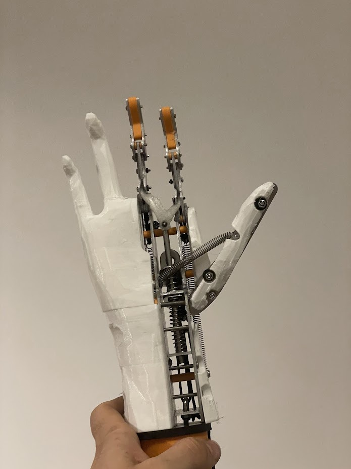
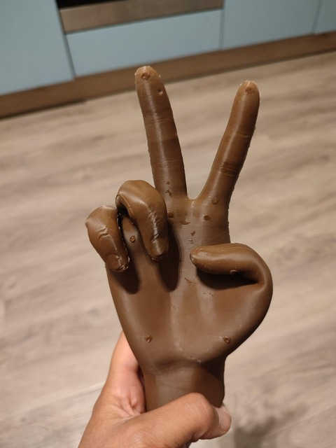
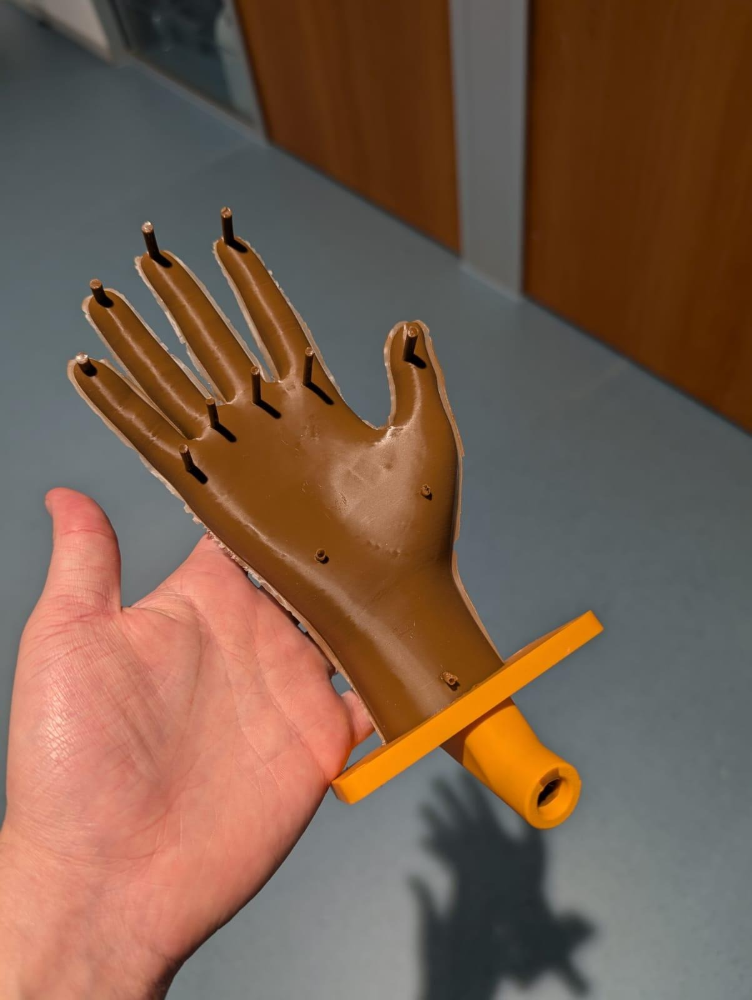
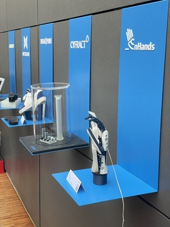
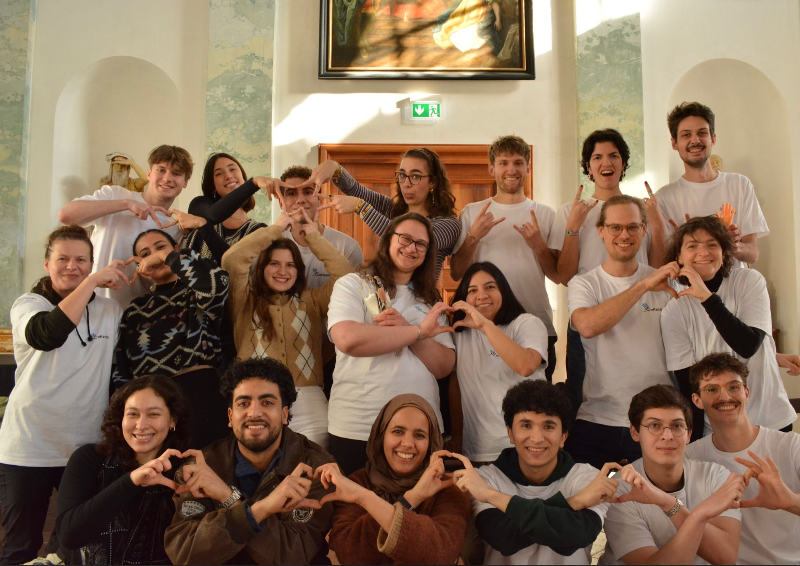

Hey everyone!

We hope the year of 2025 has been overall a nice experience! We have been busy at EnHands and continue to be with our plans for 2026. Our team has grown a lot, and this gets us even more excited for what’s to come. With that said, we wanted to share some of our updates, both regarding our prosthetics and how we organize our growing group.

## Functional hand
Our product team managed to make substantial progress on our functional prototype’s design. We have successfully incorporated a bionic tendon and a reliable locking mechanism for gripping different objects.

  

Stay tuned, since we will soon start a devlog series here on this blog, to cover all the details of our functional prototype!

## Cosmetic hand
Our cosmetic hand is the prototype with the most drastic changes: we have changed our manufacturing method for the glove, abandoning slush casting in favor of a two-piece mould design, which is filled with a construction cartridge gun. We have also changed the material used to fill the glove, going from construction foam (which had some problems, such as getting permanent dents under point pressure) to a pellet-based thermoplast material that becomes moldable at 60°C. This infill material allows for the seamless attachment of a screw that lets us use a simple wrist actuation that imitates the functional hand. This wrist is then integrated with a silicone overmolding to better imitate an actual wrist. Another advantage -- the prototype can be easily shaped into any pose, just by putting it into hot water:

We also managed to give an earlier version of this cosmetic hand to patients in Bangladesh at the beginning of 2025, through our collaboration with the Naya Qadam charity. For 2026, we are planning to increase the frequency of such collaborations to deliver our improved prototypes to patients.

## EnHands is growing!

Beginning of the winter semester, we were hit by a surprise wave of new applicants. After several years of growing at a moderate pace, we now suddenly got over 25 new members. This was a very welcome surprise for us, especially after seeing how motivated all the new people were.

With the team growing so much, so did our aspirations. Having so many talented volunteers that share our passion allowed us to shift to a more structured organization with independent subteams, which are being led both by long-time members a well as motivated people that joined as recently as only a few months ago. In the product team, we now have four independent teams finishing the current-gen, and inventing the next-gen versions of both our functional and cosmetic prototypes. In organization and marketing, we now have subteams taking care of acquiring funds, organizing patient feedback, travel, social media, and the blog you're reading, among others. This will allow us to better focus our efforts, integrate new members and quickly provide them with interesting tasks.

  

It has truly been a pleasure to see people from all kinds of backgrounds join us, be it in the production side of things with our fellow engineers, or in the organisation and marketing teams where we get to communicate at least some of what we do :D

To reach all of our increasingly exciting goals we have successfully held a donation campaign, and are still accepting donations! 2025 has been a big step up in our financial security, but our activities from prototyping to travelling to our target countries always demand sufficient funds. So if you believe in us, here’s another way you can help: [donate to EnHands here](https://enhands.de/#donate). You can also [follow us through socials](https://www.instagram.com/enhands/) so that you can keep up with us!

  

Thank you so very much for staying with us throughout 2025, we look forward to what’s ahead in 2026! Thank you especially to all of our very dedicated team members, as they are the ones that make EnHands a reality.

See you soon!

**The EnHands team**
