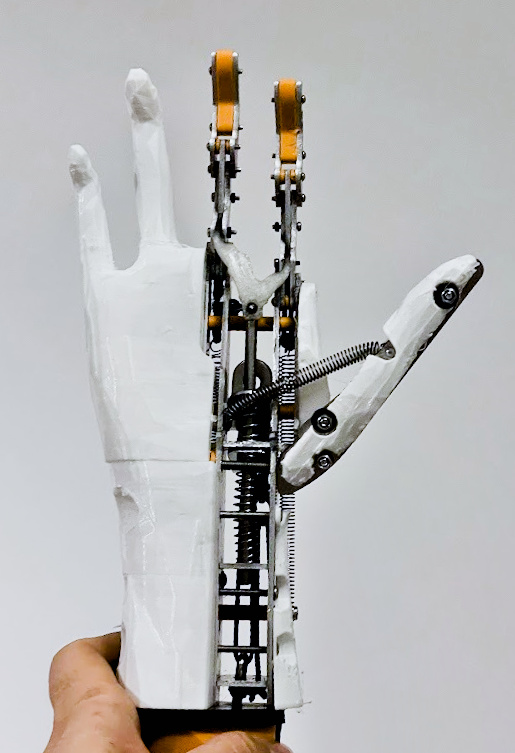
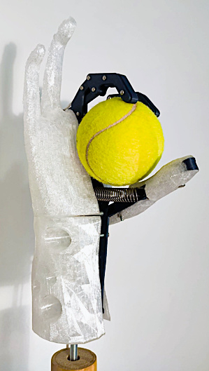
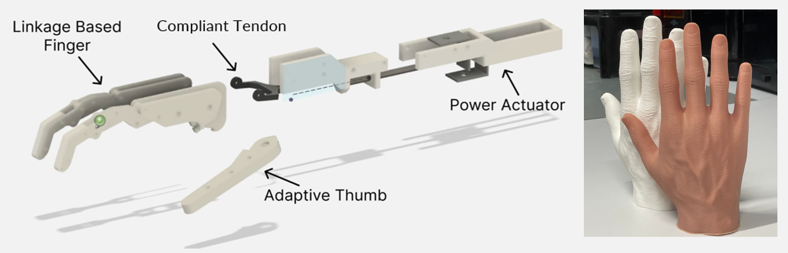

After over a year of dedication, testing, designing and redesigning, **we're ready to present to you in depth the EnHands Functional Hand prosthesis!** We’ve taken everything we learned from our earlier versions — the feedback, the challenges — and used it to take a step forward in the development of our design.

Our functional prosthesis design has seen many iterations and improvements over time, and  we're always in the process of developing it further. **We are kicking off this deep dive blog series to explore the ideas, materials, mechanisms, and design philosophy behind this new prototype, and explain in detail how all its parts play together.** Our explainer and devlog series will cover the adjustable thumb, the mechanisms for power transfer, user input, and the wrist, and finally, how the core skeleton will be fitted with a cosmetic glove. This post is the introduction to the hand design on a high level, and a teaser to what’s coming on this blog in the coming weeks!

  <figure>
    
    <figcaption>Functional prosthesis (sheet metal skeleton)</figcaption>
  </figure>

  <figure>
    
    <figcaption>3D-printed prototyping version</figcaption>
  </figure>

## The Big Picture

What if a prosthetic hand could be not only functional and lifelike — but also affordable?

That question is what led us to create the new version of the EnHands Functional Hand. When we started EnHands, we set out on a mission: **to design a prosthetic hand that could truly make a difference — not just in how it works, but in who can access it.** In 2024, after a lot of initial research and prototyping, we started investing serious efforts into the development of our new Functional Hand. The result is our new prototype that combines **functionality, aesthetics, and affordability**.

## What Makes It Work?

The Functional Hand prosthesis features a **rigid skeleton made from aluminum** that enables three hand poses: one for a power grasp, one for a pinch grasp, and one for a natural hand position while not grasping. These are made possible by fingers and a skeleton made from **sheet metal** — including an **adaptive thumb** and two **linkage based fingers** — working together with a flexible TPU-based **compliant bionic tendon** that allows for adaptability when grasping. Two additional passive fingers (ring and pinky finger), also made from TPU, complete the form of the hand.

On the outside, the prosthesis is covered with a **silicone glove**, which provides a skin-like appearance and texture.

  <figure>
    
    <figcaption>Schematic of the functional prosthesis skeleton, and view of the silicone glove</figcaption>
  </figure>

A lot of design work went into these components, and we'll explain them in a lot more detail as part of this blogpost series.

## How Is It Powered?

Instead of using electronics, we chose a **body-powered actuation mechanism**, designed to be accessible and reliable, as well as easy to repair, robust and not requiring high skill for maintenance. Here’s how it works:

- When the user wears the prosthetic hand, a **Bowden cable** connects the prosthesis to their upper arm.
- The user **extends their elbow**, the movement pulls the cable and closes the hand, which stays locked after retracting the elbow.
- Repeating the movment applies more grasping force via a **pumping mechanism**, inspired by the mechanics of silicone pumps.
- To release, the user presses a button on top of the prosthesis.

Simple, robust, and effective!

## What’s Next?

Even though we’ve come a long way, this is still a prototype — one we’re constantly improving. Right now, we’re focusing on:
- Optimizing the **input-output force ratio**,
- Further increasing **durability** of the prosthesis,
- Simplifying the **manufacturing process** to enable local, low-cost production.

We’re proud of how far we’ve come — and even more excited to share what’s ahead.

So stick around! In the next posts, starting next week with the adjustable thumb, we’ll cover all the parts that make up our prosthesis in much more detail and explain our design decisions and the mechanics behind the new EnHands's Functional Hand. 

**Stay tuned!**
