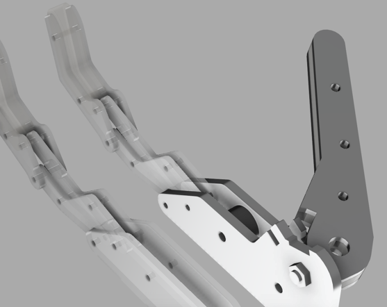
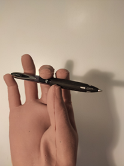
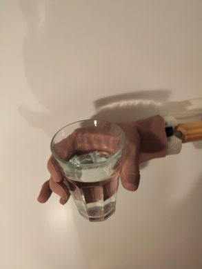
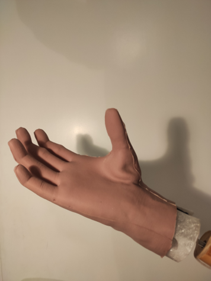
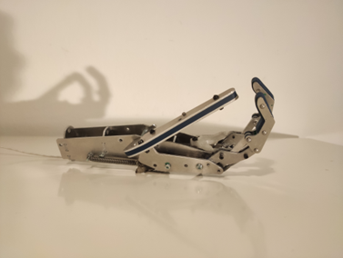
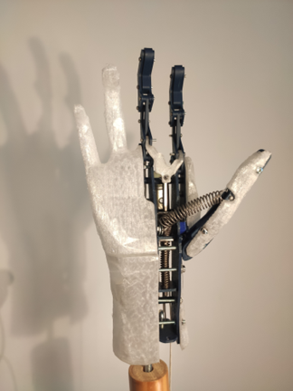

# Functional Hand Deep Dive, Part 2: Adjustable Thumb
### *Does our adjustable thumb readjust our expectations?*

    

After our intro post, with this blogpost we're fully starting our series of diving deeper into different parts of our prosthesis design, talking about its many features and trying to go into the details of what we are doing here at EnHands.
This post touches on our original thumb design, why we think it is great, why it works, and what we want to do with it.

**Our Adjustable Thumb Design: The best of both worlds**

As you may have gotten from our last blogpost, our design works by actuating digits II to V (all but the thumb), which allows us to follow through with a passive thumb that can be adjusted manually, sitting between one of three positions. This is special in our design: other prostheses are usually either hand-actuated as ours, but only open and close, or allow more complex manipulation, at the cost of requiring electrical components.
This concept aligns well with our values since by being simple, robust and cheap, we are sure to hit our use case of low income countries as it is easy to repair and uses components of your run-of-the-mill hardware store.

    <video autoplay loop muted playsinline controls style="width: 100%; max-width: 720px; height: auto; display: block; margin: 0 auto; border-radius: 8px; box-shadow: 0 4px 8px rgba(0,0,0,0.1);">
        <source src="../blog/images/thumb-mechanism.mp4" type="video/mp4">
        Your browser does not support the video tag.
    </video>
    
The adjustable thumb mechanism in action

**How our thumb works**

Our thumb is passive, which means that there is no active gripping done by it. The other fingers then need to exert more force to compensate, but this allows us to make a design that has a lot of flexibility. Through some clever geometry and the usage of a spring, the user can change the position of the thumb using his/her other hand. This then allows for 3 distinct positions:

    <h4 style="margin-bottom: 15px;">Pinch grasp</h4>
    

    <h4 style="margin-bottom: 15px;">Power grasp</h4>
    

    <h4 style="margin-bottom: 15px;">Cosmetic/resting pose</h4>
    

Pinch grasps are useful for tasks that require fine motor control like holding a pencil. Power, on the other hand, being used for more strength-oriented tasks, such as holding gardening tools. This gives users a lot more flexibility for different use cases while keeping the design simple. Yet, although functional, offering only these two positions would be problematic aesthetically, as it would be the equivalent of someone walking around making an “Ok” sign all the time (which although very good vibes, isn’t very nice for people who want to blend in). Knowing this, we’ve also incorporated a “cosmetic” position, where the thumb rests alongside the remaining fingers, emulating a resting hand.

**What makes our hand special?**

In most cases, prosthesis designs opt to either not allow the thumb to move at all, or to fully actuate it. Both approaches are viable, but pose a compromise since allowing no motion limits the thumbs functionality, mostly keeping it out of use. Meanwhile, full actuation of the thumb leads to either a very complicated/expensive design or to a lack of flexibility in use cases. This is because actuating the thumbs rotation would imply a whole new degree of freedom (complicated and expansive), while the other option of just actuating opening and closing (cheaper and simpler) makes it impossible to adjust its position.
We instead opted for decoupling the thumb from the actuation system while still making it adjustable.
This allows the user to manually set the thumb to different positions without needing motors, sensors, or complex control systems, something that aligns with our goals of a cost-effective and robust design.

**Who doesn't love robust hands?**

    

The design of our thumb is made of a single metal piece, that is, besides the TPU covers, springs and screws, we have a *unibody design*. It can be made from standard metal parts found in any local hardware store. It features:
* A single joint at the base.
* A metal spring for positioning (not actuation).
* Interlocking shapes in the interface between the thumb and the remaining of the palm to hold it in place.

The great advantage of this design is that it doesn't rely on precise tuning or fragile mechanisms. Instead, the geometry of the parts provides resting positions, and the spring maintains tension so that the thumb clicks securely into place.

**Limitations and future improvements: What do we think of our thumb?**

    

Currently, we are very happy with our design, but it is not perfect, not final. Knowing this the current takeaways are:
•	Thumbs up: Our design is extremely low-cost, while also being very durable, robust, and simple to manufacture and repair.
•	Thumbs down: The thumb brings no active contribution to the grip force, meaning that the thumb can’t “push” like a human thumb. That means that the other fingers need to take over.
•	Thumbs sideways? Visually, some may expect a more complex structure than the very basic skeleton our thumb currently has. Most of the cosmetic shape comes from the glove covering it. We could try to shape the thumb more to have something that could be more aesthetic, but this is not deemed necessary currently.

Again, we’ve considered whether more advanced versions could include shaping elements or additional joints, but for now, simplicity wins. The current design does need to compensate for the lack of thumb actuation, but we have managed to do that by using our power transfer mechanism (which we will also cover in another blogpost).

**Looking Ahead**

This design is still evolving. We’re especially focused on testing robustness since we want to be sure that even high-effort tasks such as using a shovel wouldn’t dislodge the thumb’s position. For this we need some validation, which will be carried out internally (expect yet another blogpost for this when the time comes). Early results are promising, and we’ll share more as testing continues!