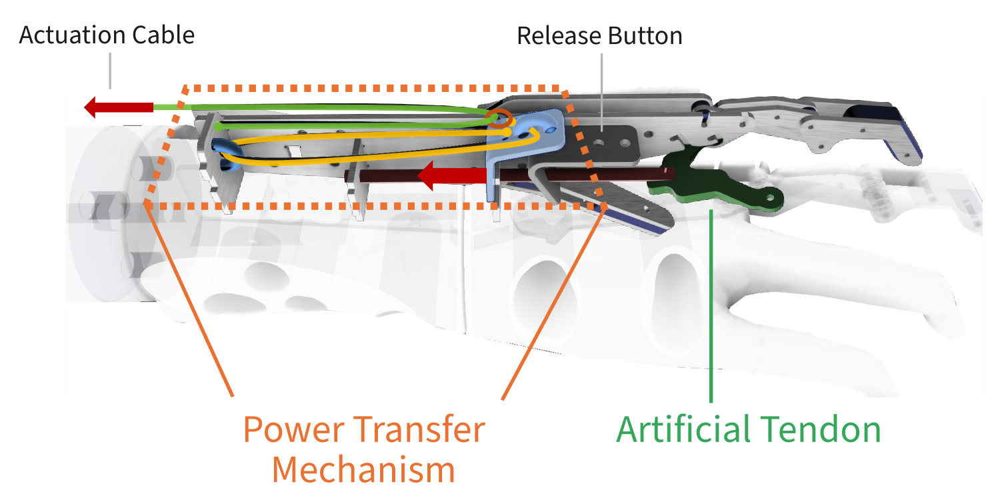
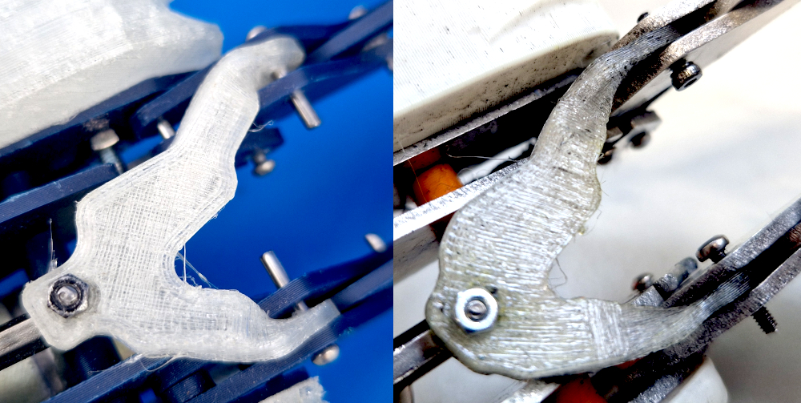
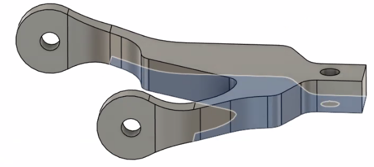
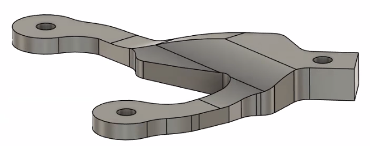

The EnHands functional hand prosthesis deep dive continues today with a question that is right at the core of our functional hand design: **how to apply the force that lets the prosthesis user grasp an object?** 

Our design features two mechanisms to address this question. First, it uses a block and tackle, the **power transfer mechanism**, that allows the user to pump multiple times to close the prosthesis. The grasp closes tighter on each pull, and only releases at the press of a button. Second, we have a **artificial tendon**: this connecting piece is crucial, as it links the index and middle fingers in a flexible way which allows them to adapt their movement to the grasped object's shape.

    
    <figcaption style="text-align: center; font-style: italic; margin-top: 10px; color: #666;">Power transfer mechanism and artificial tendon in our prosthesis.</figcaption>

## Power Transfer: Pulley Mechanism
When the user actuates the prosthesis by pulling a cable, the movement is routed via a pulley mechanism with **5:1 mechanical advantage** to require less force. The grasping mechanism closes, and is held in place by a stepless ratchet mechanism (counteracted by a spring) after releasing. Now the user can pull again and again to apply more force.

We learned from earlier prototypes: in the beginning, we tried simpler mechanisms, like a discrete-step ratchet mechanism, that made tightly grasping an object impossible. The switch to the new power transfer mechanism marked the beginning of the current generation of our functional hand.

## Artificial Tendon

When a user grasps with the prosthetic hand, the index and middle finger move towards the thumb, while the thumb stays in place. The two moving fingers should usually move together. However, if they are linked rigidly, this limits their applicability: Imagine you're trying to grasp an object that is not flat, such as a watter bottle. When the first finger reaches the object, the second finger is not on the bottle yet, but is blocked from moving any further. To allow both fingers to reach the object and therefore grasp it much more securely, we needed a mechanism that distributes the force accordingly. This is the role of the **artificial tendon**: the tendon is a linkage piece that holds the two fingers together, but is flexible enough so it can bend and allow one finger to continue moving while the other is already on the grasped object. For the user, this translates into higher dexterity and grasp adaptability, which is crucial for making the prosthesis useful in day-to-day life.

    
    <figcaption style="text-align: center; font-style: italic; margin-top: 10px; color: #666;">The artificial tendons on two of our prototypes</figcaption>

The artificial tendon in its current form is 3D-printed from thermoplastic polyurethane (TPU), a strong, but at the same time flexible material. In a previous version, we tried a much simpler tendon which consisted of just a couple of rubber bands. Going forward, we might be able to stamp the tendon from rubber as an accessible manufacturing method.

Initially, we had one challenge with the 3D-printed tendon: the layering direction inherent to the 3D printing process caused the tendon's attachment points to break easily - which is not acceptable for the part that needs to transmit all the grasping force! By rotating the attachment points in the 3D model, and bending them into place after printing (which the flexible TPU material allows), we could obtain a much more stable tendon. This is a good example of the many engineering iterations we often need to solve a challenge that seems simple at first, but turns out to be more intricate when you address it.

    

        

            <figure style="margin: 0; text-align: center;">
                
                <figcaption style="margin-top: 10px; font-style: italic; color: #666; text-align: center;">Fragile tendon design due to 3D print layering.</figcaption>
            </figure>
        

        

            <figure style="margin: 0; text-align: center;">
                
                <figcaption style="margin-top: 10px; font-style: italic; color: #666; text-align: center;">Stable current version of the tendon (before being bent into place).</figcaption>
            </figure>
        

    

Are you wondering why the tendon has such an asymmetric shape? The reason simply is that the fingers are not at the same height - the middle finger is offset 12mm to the front, which means that the tendon needs to be asymmetric to evenly actuate the fingers. Designing it, we kept in mind that the two branches of the tendon should be elastic, and the rest relatively inelastic. To achieve this, both branches start thin at the ends, and reach a thicker part of the tendon at the same distance from their attachment points.

**What's next?**
Now you know how the core mechanical functions of our hand work: The power transfer mechanism and tendon that we just described, together with the adjustable thumb (which our last post was about), will allow the users of our prosthesis to grasp objects in their everyday lifes. But that's not all yet: Our next post in two weeks will discuss the *wrist mechanism*, and we have several more topics to cover after that. Stay tuned!