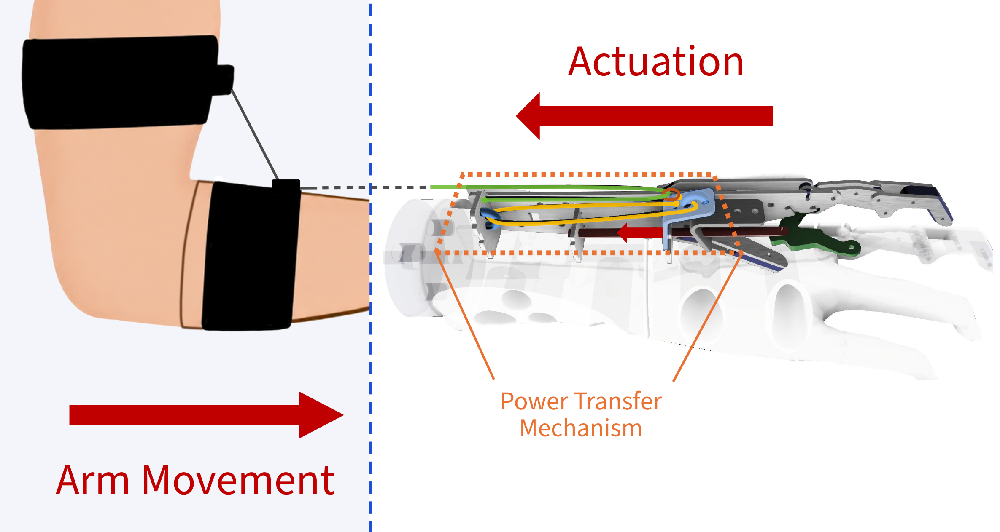
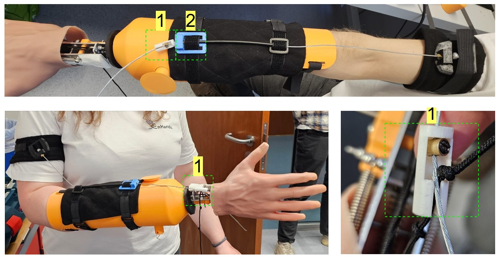

## How do we bring our hand to life?

In the last parts of our deep dive series, we explored the [adjustable thumb](pages/blogpost.html?post=2026-03-17-functional-hand-deep-dive-part2-adjustable-thumb), the [power transfer mechanism and artificial tendon](pages/blogpost.html?post=2026-04-02-functional-hand-deep-dive-part3-artificial-tendon-power-transfer-mechanism), and the [wrist](pages/blogpost.html?post=2026-04-18-functional-hand-deep-dive-part4-wrist-mechanism). But all of these components still depend on one essential ingredient to work together: **actuation**. In our case, actuation refers to the pulling force that closes the fingers of the functional hand and enables grasping.

Because our prosthesis is completely passive, there are no motors, sensors, or batteries involved. Instead, the user’s body movement provides the input force. This keeps the system simple, robust, repairable, and suitable for low-cost production. At the same time, it places high demands on the interface between the user and the prosthesis, since the force must be transmitted reliably and comfortably.

For this reason, we have been testing different actuation concepts on **bypass sockets** — temporary test sockets that let us simulate the prosthesis setup on a healthy person before moving on to amputee testing. At the moment, we are comparing two versions: an elbow actuation system and a shoulder actuation system. Both can activate the prosthesis, but they differ in usability and mechanical trade-offs. This post focuses on the elbow version, which currently shows the most practical potential in our setup.

## Elbow Actuation: Our Current Design

The elbow actuation system is based on a simple principle: the user generates pulling force through arm motion, which is transferred to the hand via a Bowden cable.

The system uses two straps, one attached to the forearm socket and one around the upper arm. The cable is routed through the **antecubital region** (the inner elbow area) so that it follows the natural path of elbow movement.

  <figure>
    
    <figcaption>Elbow actuation: Extending the arm forward pulls the actuation cable on the prosthesis and makes it perform a grasping movement.</figcaption>
  </figure>

When the elbow extends, the movement of the two straps pulls the cable. This motion closes the fingers of the prosthetic hand. Testing also showed that this does not only happen when reaching forward: keeping the hand in place and moving the shoulder back can also actuate the hand, since this motion extends the elbow as well. This is especially important for stable grasping, because it gives the user more than one natural way to activate the hand.

One advantage of this setup is its discreetness. It can easily be hidden under clothing, which is important for everyday use where appearance and comfort matter as much as functionality. It also integrates well into our current socket design, since it does not require a large or bulky external harness.

However, we observed that strap slippage on the upper arm can affect force transmission. Since the arm geometry varies significantly between users, the fit is not automatically consistent. This is one of the key reasons we are iterating and testing different configurations rather than relying on a single design.

## How We Calibrate the Setup

To make the elbow actuation work in the same manner every time, the cable position has to be calibrated first. The system needs a defined starting point and a clear limit for how far the cable can move during operation. For this reason, the prosthetic socket includes a fixed cable end-stop (2), and we added a 3D-printed anchoring and tensioning block (1) in between, which lets us set and lock the cable position precisely.

We begin with the elbow fully extended, which gives us the maximum cable length. The anchoring block (1) is then moved until it touches the socket-mounted stop (2). Once that position is reached, the locking screw is tightened, which fixes the cable in its calibrated starting position.

  <figure>
    
    <figcaption>Calibration process: anchoring and tensioning block (1) and socket-mounted stop (2) on our bypass socket</figcaption>
  </figure>

After that, the elbow is flexed to around 90 degrees so the system can be connected to the prosthetic hand input mechanism. This flexed position creates the slack needed for assembly. Once the user starts extending the arm again, the anchoring block (1) moves until it reaches the stop (2), and the resulting relative motion pulls the cable to close the hand.

This calibration step is crucial. It ensures that the system starts from a known reference position and that cable movement is controlled and repeatable, which helps the hand respond more consistently during use.

## What We Learned from Testing

Testing gave us several important insights about the elbow actuation system. First and foremost, **cable tension** is essential for functionality. If the cable is not tensioned properly, the actuation becomes weak or unreliable, and the hand will not close with the consistency we need.

We also saw that **loose straps and slipping** during movement reduce the effectiveness of the whole system. If the harness shifts on the body, part of the motion is lost before it reaches the hand. This means that the system can underperform if the body interface is not stable enough.

To better understand the behavior of the setup, we also took some initial measurements. For this version, we found 90 N as comfortable force, 130 N as maximum force, and 100 mm of cable travel. These numbers were measured with healthy subjects using the bypass socket, so they give us a first reference for how much force and movement the system can handle in this setup. Measurements with amputee users still need to be performed, since they often have less muscle strength in the arm.

We also **compared the elbow setup with a shoulder actuation version**. This version is essentially an extension of the elbow harness, but it connects to the opposite shoulder instead. Here the band slips less easily, and it can be an advantage that the opposite shoulder can be used. However, it also restricts movement more, is more noticeable when worn, and uses more material for the harness.

At the moment, we do not see one harness as universally better than the other, because different people prefer different designs. For that reason, we want to provide both options depending on the user’s preference.

## Looking Ahead
The actuation system is **one of the most important parts** of the prosthesis, even though it is not the most visible. It forms the connection between the user and the hand, and if that connection is weak or uncomfortable, the rest of the design loses much of its practical value.

This is why we spend so much time on the harness and cable interface. We want body movement to be converted into a clean and controlled pulling force with as little loss as possible. Our elbow actuation setup shows that this is achievable: it is capable of closing the hand, while being simple, low-cost, and discreet.

Of course, the prototype is still evolving. We still need to improve the harness fit, reduce slipping, and refine the tensioning behavior so the system performs more consistently across different users. But the current results are encouraging, because they show that the basic concept is sound and that the next steps are about refinement, not reinvention.

As always, we will keep testing and improving the actuation interface, since it remains one of the key elements that make the prosthesis usable in everyday life.
